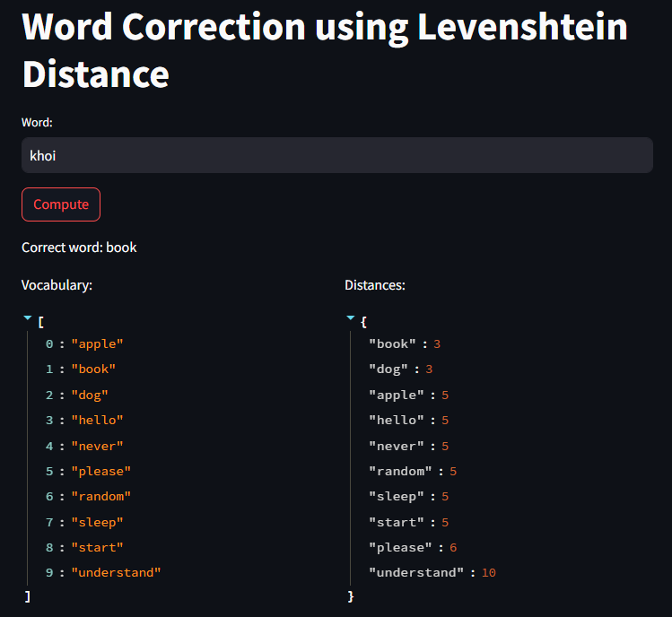
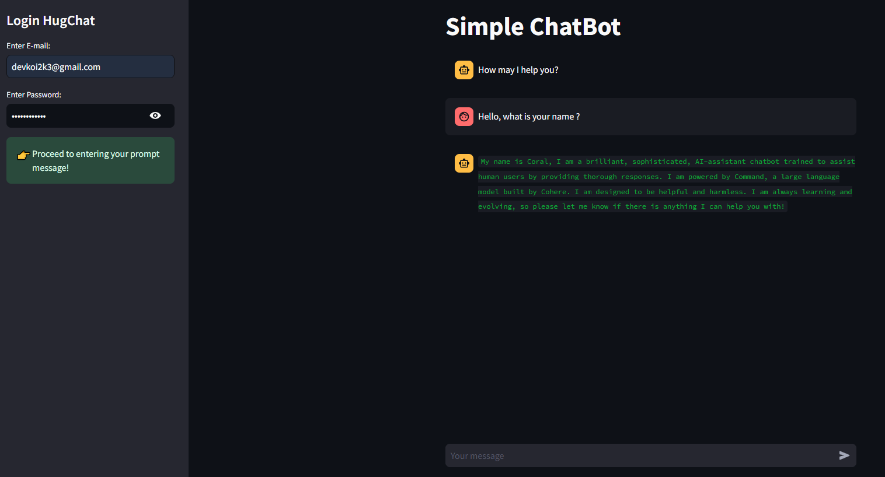

# Streamlit Projects

## Overview
This repository contains multiple projects that leverage Streamlit for deploying interactive web applications. Streamlit is a powerful framework for building data-driven applications quickly and efficiently.

## Projects
1. **Chatbot**: An interactive chatbot application.
2. **Levenshtein Distance**: An application to compute the Levenshtein distance between two strings.
3. **Object Detection**: A web app for detecting objects in images.

## Installation
To set up the environment, follow these steps:
1. Clone the repository:
   ```bash
   git clone https://github.com/Koii2k3/Streamlit.git
   ```
2. Navigate to the project directory:
   ```bash
   cd Streamlit
   ```
3. Install the required packages:
   ```bash
   pip install -r requirements.txt
   ```

## Running the Applications
To run any of the applications, use the following command:
```bash
streamlit run path/to/your_app.py
```

Replace `path/to/your_app.py` with the relative path to the specific application you want to run.

## Directory Structure
- `Chatbot`: Contains files related to the chatbot application.
- `LevenshteinDistance`: Contains the Levenshtein distance application.
- `ObjectDetection`: Contains the object detection application.
- `data`: Directory for storing datasets.

## Example Usage
### Chatbot
Run the chatbot application:
```bash
streamlit run Chatbot/app.py
```
### Levenshtein Distance
Run the Levenshtein distance application:
```bash
streamlit run LevenshteinDistance/app.py
```
### Object Detection
Run the object detection application:
```bash
streamlit run ObjectDetection/app.py
```

## Screenshots
<div align="center">
   
   
   
</div>
